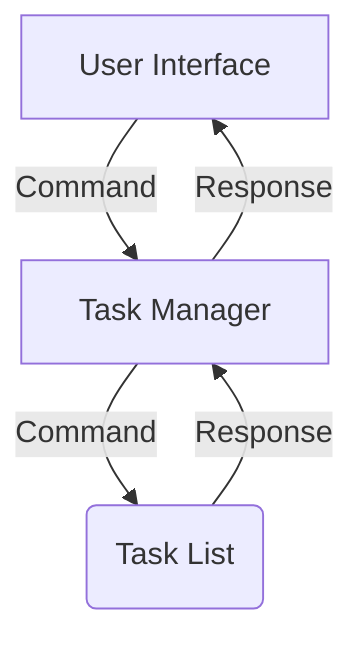

# Main Design

This document outlines the design of the *main.py* file, serving as the executable file to run the To-Do List Manager. This file will contain the functions to operate the command-line interface, which will receive user functions and communicate with the Task Manager.

## Requirements
- Add Task: Allow users to add new tasks with a brief description.
- List Tasks: Display all existing tasks with their status (Pending/Done).
- Mark Task as Done: Enable users to mark a specific task as done by its task number.
- Delete Task: Permit deletion of a task by its task number.
- Help/Usage: Provide a help menu that outlines how to use each command.

## Implementation
- array to store tasks
    - custom Task struct to store:
        - Description (str)
        - Status (bool)
        - Task Number (int)
- Command-line interface

## Components
- [Task Manager](TaskManager_Design.md)
- [Task Dataclass](Task_DataClass_Design.md)

## Public Methods
*func main() {}*

    Main function for the code, initializing the TaskManager and starting the command-line interface

## Private Methods
*func commandLine(manager TaskManager) {}*

    Starts the loop to run the command-line interface

    Arguments:
        manager (TaskManager): the TaskManager instance which controls the list of Tasks

*func validate(entry string) bool {}*

    Validates a user input string against known options

    Arguments:
        entry (string): the entry entered by the user
    Returns:
        True if it is valid, False otherwise
    

## Stucture
