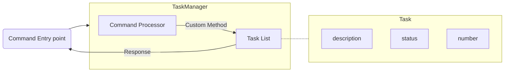

# Task Manager Design

This document outlines the design of the Task Manager, which receives input from the command-line interface, validates it, and processes the command to control its list of Tasks before responding to the user.

## Requirements
- Contain an array of Task structs
    - built-in array structure
- Ability to receive commands 
- Ability to validate commands
- Ability to respond to the frontend
- Custom methods to interact with the array of Tasks

## Structure
