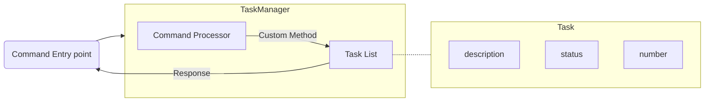

# Task Manager Design

This document outlines the design of the Task Manager, which receives input from the command-line interface, validates it, and processes the command to control its list of Tasks before responding to the user.

## Requirements
- Contain a slice of Task structs
    - built-in slice structure
- Ability to receive commands 
- Ability to validate commands
- Ability to respond to the frontend
- Custom methods to interact with the slice of Tasks

## Public Methods
```Go
type TaskManager struct {
    tasks []Task
}
```

*func (t *TaskManager) add(task Task) {}*

    Adds a given Task to the slice

    Arguments:
        task (Task): the Task we want to add

*func (t TaskManager) list() []string {}*

    Returns a string array of Tasks in the slice

    Returns:
        a slice of strings containing the required Task information

*func (t *TaskManager) mark(number int) {}*

    Marks the Task at a given number complete

    Arguments:
        number (int): the Task number we are marking as complete
    
*func (t *TaskManager) delete(number int) {}*

    Deletes a Task at a given number

    Arguments:
        number (int): the Task number we are deleting

*func (t TaskManager) help() string {}*

    Returns a help menu for the user with instructions for each command

    Returns:
        a string help menu

*func (t TaskManager) find(number int) int {}*

    Finds the index of a task number in the Tasks slice

    Arguments:
        number (int): the task number we are searching for 
    Returns:
        the index number

## Structure
